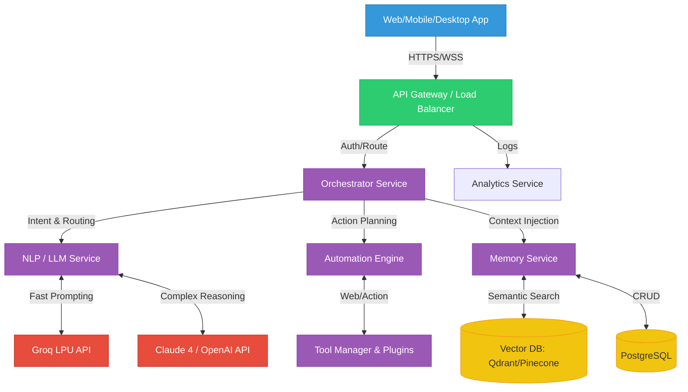

# JARVIS AI - System Architecture

This document describes the high-level system architecture and data flow for the JARVIS AI platform. It is designed to achieve the <3-4s end-to-end latency constraint.

## 1. High-Level Architecture Diagram

## 2. Core Microservices

1.  **API Gateway (Node.js/Express or Nginx):**
    - Handles SSL termination, rate limiting, and JWT validation.
    - Maintains WebSocket connections for real-time text streaming.

2.  **Orchestrator (Python / LangGraph):**
    - The "Brain of the Brain".
    - Receives raw text/audio, determines the required sub-tasks, and fires them off in parallel.

3.  **NLP Service (Python / FastAPI):**
    - Handles Prompt formatting.
    - Abstracts the underlying LLM provider (Claude, OpenAI, Groq), routing simple queries to Groq and difficult ones to Claude.

4.  **Memory Service (Python):**
    - Fetches User Context. Converts queries to Embeddings (OpenAI `text-embedding-3-large`).
    - Queries Vector DB and uses Cohere Rerank to find top 3-5 memories to inject into the Prompt.

5.  **Automation Engine (Node.js or Python):**
    - Executes actual commands (Calling Gmail API, OS-level Python scripts via Electron, Selenium/Puppeteer scraping).
    - Queues heavy background tasks via Celery + Redis.

## 3. Storage Layer

- **Relational (PostgreSQL 16):** User accounts, Subscription statuses, Auth logic, Structured logs, Audit trails.
- **Vector DB (Qdrant / Pinecone):** 1536-dimensional embeddings for memory nodes.
- **Cache (Redis 7.0):** Active session data (Layer 1 Memory), Rate-limit counters.
- **Unstructured (MongoDB):** Raw chat transcripts and conversation history for UI rendering.

## 4. Latency Mitigation Strategies

- **Parallel Execution:** Memory fetching and Intent Detection run simultaneously.
- **Response Streaming:** The NLP service streams tokens back through the Orchestrator directly to the Client WebSocket buffer.
- **Groq LPU:** Used specifically for "greeting", "chit-chat", or simple queries where TTFT (Time To First Token) dictates perceived speed.
